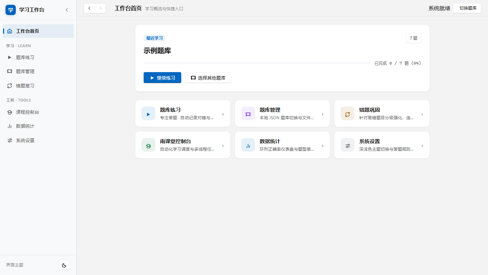
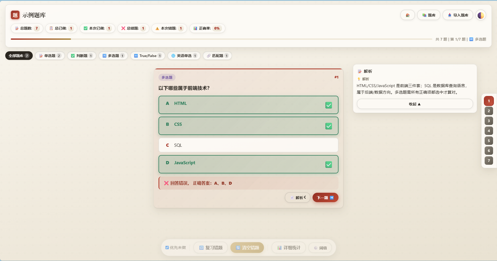
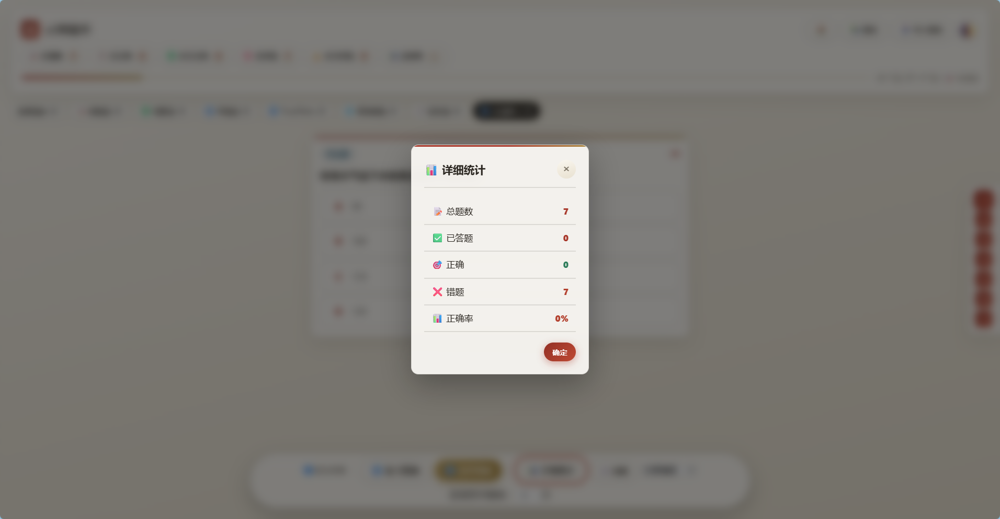
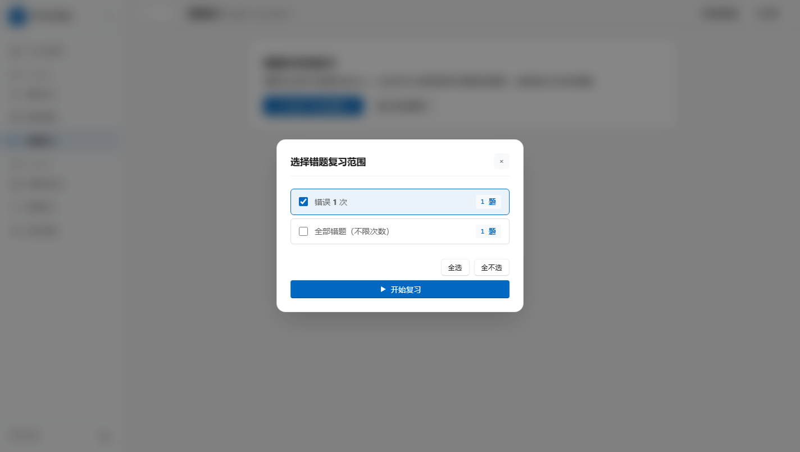
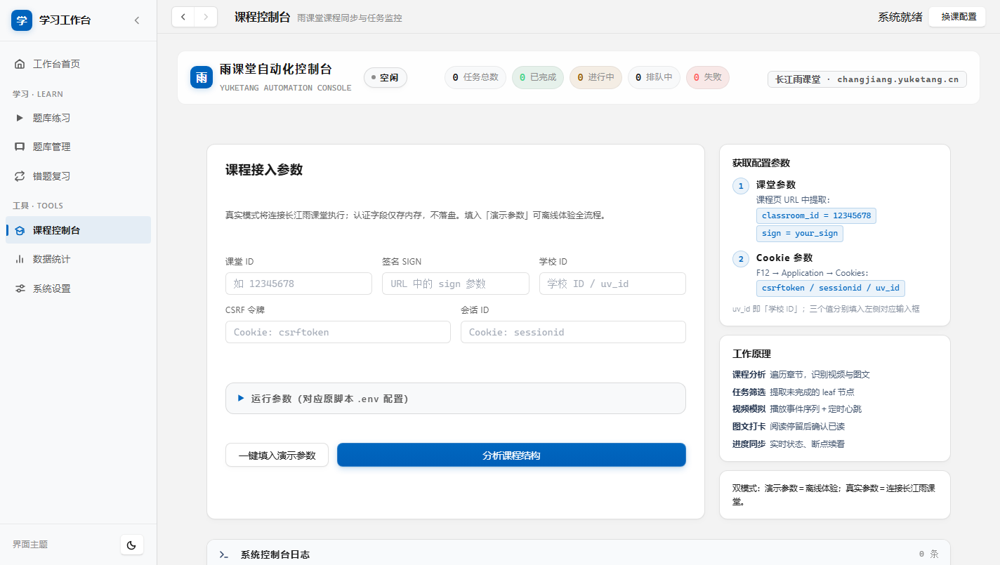
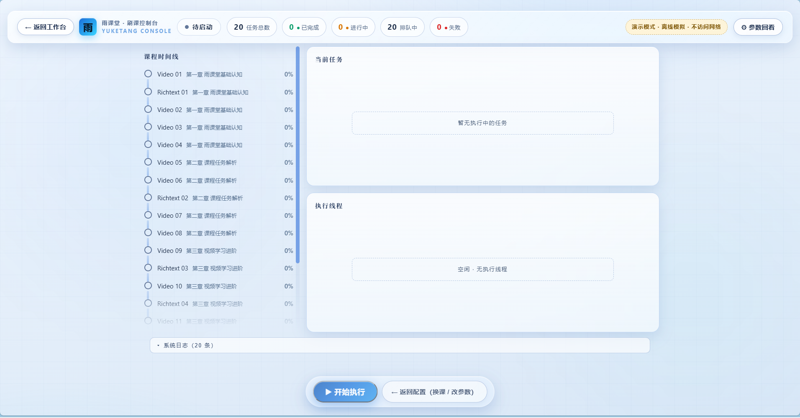

# Study Workbench

[English](README.md) | **简体中文**

> A local study platform combining **quiz practice** and a **Yuketang course console**: import JSON question banks to practice, and drive your Changjiang Yuketang courses from a web console.
> Runs fully offline on your machine — no database, no cloud. **This repository ships with NO question-bank data.**


---

## ✨ Features

### 📚 Quiz Practice
- **Six question types**: single choice / true-false / multiple choice / matching (click-to-pair) / English single choice with translation
- **Wrong-answer book**: tracks mistake counts per question, filter reviews by error count, auto-removes questions after N consecutive correct answers
- **Progress persistence**: localStorage keeps your history; resume exactly where you left off
- **Statistics panel**: totals, accuracy, wrong-question distribution at a glance
- **Directional slide animations, light & dark themes (paper × ink), keyboard shortcuts (number keys to answer, ← → to navigate)**
- **Analysis panel**: slides out automatically when you answer wrong; manual toggle otherwise

### 🎓 Course Console (Yuketang)
- Configure course credentials → analyze structure → task timeline → multi-threaded execution
- Live progress bars, per-task states (running / done / skipped / stopped / failed), system log terminal
- **Dual mode**: fill in the demo parameters for a full offline simulation, or use real credentials to drive your actual Changjiang Yuketang courses online

---

## 🚀 Quick Start

### Option 1: Download the EXE (Windows)
Grab the latest `StudyWorkbench-v*-windows-x64.exe` from the [Releases](../../releases) page and double-click to run.

> **⚠️ Windows tips**
> - **Move it to a writable folder first** (e.g. `D:\StudyWorkbench\`) before running — imported banks are saved to `question_banks\` next to the exe, which can fail inside `C:\Program Files\` or straight from an un-extracted zip.
> - **SmartScreen notice**: the EXE is not code-signed. On first launch click *More info → Run anyway*.
> - **Progress lives in your browser** (localStorage bound to `localhost:8000`). Switching browsers — or the app hopping to port 8001 when 8000 is busy — starts a fresh slate on that origin.
> - **Auto-exit**: closing all pages shuts the background server down within ~15 s, releasing the port. Reopening a page during that window keeps it alive.

### Option 2: Run from source
```bash
pip install -r requirements.txt   # requests
python main.py                    # Python 3.11+
```
Your browser opens `http://localhost:8000` automatically (ports 8001–8009 are tried if busy).

### Importing question banks
> The repository and the app ship **without any question data** — bring your own JSON bank.

1. Click 「📥 导入题库」(Import bank) on the bank-selection screen and pick a JSON file
2. Imported banks are archived to `question_banks/` automatically — they reappear after restart, progress included
3. You can also drop JSON files into `question_banks/` directly and refresh

The in-app 「📋 查看导入格式说明」 explains the format. A complete reference covering **all six question types** lives in [`examples/demo-bank.json`](examples/demo-bank.json) — copy it and make it yours.

---

## 📋 Question bank format

Banks are UTF-8 `.json` files:

```json
{
  "meta": { "name": "My Bank", "version": "1.0" },
  "categories": {
    "key": { "label": "📖 Chapter", "questions": [ … ] }
  }
}
```

| type | Meaning | Required fields | ans format |
|---|---|---|---|
| `single` | Single choice | id, q, opts[] | index of correct option (0-based) |
| `judge` | True/False (Chinese) | id, q, opts[] (two items) | `0` or `1` |
| `TF` | True/False (English) | same as judge | same as judge |
| `multi` | Multiple choice | id, q, opts[] | array of indices, e.g. `[0,2]` |
| `en_single` | English single choice | same as single | same as single |
| `matching` | Matching | id, q, left[], right[], ans[] | `ans[i]` = right-index paired with left item i |

Optional fields on every question: `analysis` (shown when you answer wrong), `memo`, `q_trans`.

Rules: `id` must be unique across the whole bank; invalid questions are skipped; categories without valid questions are dropped.

---

## 🖥️ Screenshots

| Workbench home | Quiz practice |
|---|---|
|  |  |

| Statistics | Resume progress |
|---|---|
|  |  |

| Course console · setup | Course console · execution |
|---|---|
|  |  |

*(Interface text is Chinese-first; an English UI is on the roadmap.)*

---

## 🗂️ Project layout

```
├── main.py                # Entry point: starts HTTP server + opens browser
├── config.py              # Constants (port 8000, paths, core mode)
├── server.py              # HTTP: pages / bank scan / archive API / Yuketang API
├── templates/             # Page shells (hub / quiz / yuketang console)
├── static/
│   ├── css/               # base(design tokens·themes) → components → pages
│   └── js/                # Front-end modules (state/storage/render/answer/nav/stats…)
├── tests/                 # pytest backend suite (67 cases)
├── examples/              # demo-bank.json covering every question type
├── build.bat              # one-command EXE packaging (PyInstaller)
├── CHANGELOG.md           # Changelog (current: v1.2.1)
└── LICENSE                # MIT
```

Runtime folders (git-ignored): `question_banks/`, `dist/`, `build/`.

---

## 🎓 Course console attribution

The console is based on **[Gary-666/yuketang](https://github.com/Gary-666/yuketang)** (upstream CLI script),
rebuilt here as a web console (credential setup → task timeline → threaded execution → live logs).

- ⚠️ Currently supports **Changjiang Yuketang only**
- Ships with an offline **Mock** demo core; the **real execution core is integrated** and drives the live service when real credentials are provided (`config.CORE_IMPL = 'auto'`)
- Upstream source is loaded locally at runtime from `YUKETANG_SRC_DIR` (see config.py); it is not redistributed by this repository

## 📄 Disclaimer

- Personal study aid only — this project contains and distributes **no** exam or course content
- You are responsible for the origin and licensing of anything you import
- Follow your school's / platform's terms of service; the authors take no liability for misuse

## 📜 Version

See [CHANGELOG.md](CHANGELOG.md). Current release: **v1.2.1** (2026-08-24).

## 📄 License

Released under the [MIT License](LICENSE).
